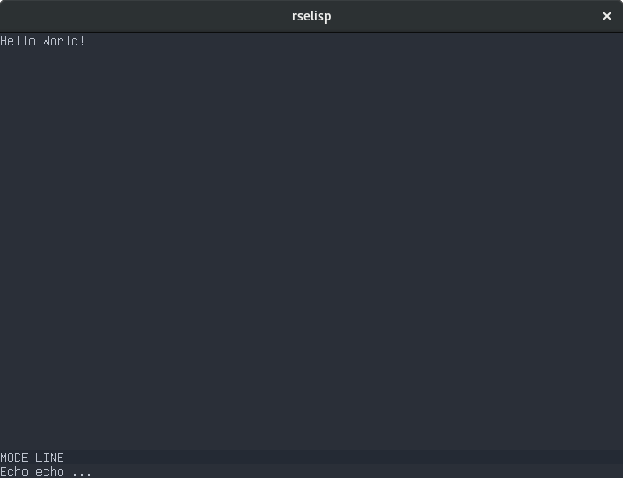

Quick Start
-----------

This is currently a crude Lisp interpreter written in Rust and loosely based
on Emacs Lisp. To try it out, do the following (assuming you have installed
cargo):

```
$ git clone https://github.com/richiejp/rselisp.git
$ cd rselisp
$ cargo run
```

Not much is currently possible, but here is some example I/O:

```lisp
(fset 'fib '(lambda (a) (if (eq a 1) 1 (if (eq a 2) 2 (+ (fib (- a 1)) (fib (- a 2)))))))
-> fib
(fib 10)
-> 89
(fset 'fibs '(lambda (a) (if (eq a 0) nil (progn (print (fib a)) (fibs (- a 1)))))
-> fibs
(fibs 10)
89
55
34
21
13
8
5
3
2
1
-> nil
'exit
'(Good bye!)
```

The contents of a file can be executed by adding the file path on the command line;

```
$ cargo run lisp/demo.el
```

You can start something resembling a text editor by doing

```
$ cargo run -- --editor
```



Benchmarks can be run with `cargo bench` and unit tests with `cargo test`. To
see what functions are implemented check `src/builtins.rs`.

Status & goals
--------------

The basic idea of this project is to write an Emacs clone in Rust which is
compatible with the original's "killer apps". Which for me includes magit,
helm and few of the programming language major/minor modes. However the
project is currently nowhere near that and is more of a learning exercise for
me. Whether it will progress beyond that is doubtful, but I have thought a bit
about it nonetheless.

The present mid-level goal is to create a basic text editor which can, in some
capacity, be extended with lisp and runs on Redox and Linux. After which I
want to fundamentally rewrite each basic component in the editor until it
provides a solid foundation to implement the built-ins required by a
non-trivial Emacs package.

More specifically I am currently trying to rewrite the Lisp interpreter
because it is too flawed to allow the editor components to pogress nicely.

Beyond personal entertainment and education, the reasons for wanting to
rewrite Emacs in Rust are pretty much the same as for any other C/C++ project
being rewritten in Rust. You can find plenty of case studies on the
Internet. It may also benefit the original project to more aggressively try
out new technologies with Elisp and the Emacs UI model. People who would not
contribute to the original C codebase may be interested in one written in
Rust; disseminating more knowledge about this fantistic piece of software.
